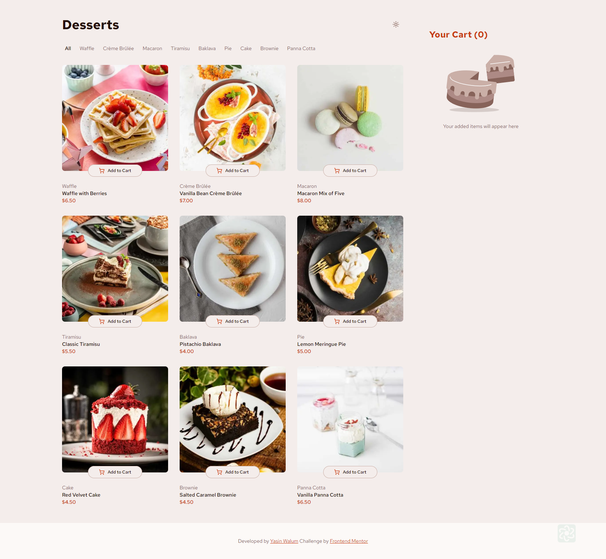

# Frontend Mentor - Product list with cart solution

This is a solution to the [Product list with cart challenge on Frontend Mentor](https://www.frontendmentor.io/challenges/product-list-with-cart-5MmqLVAp_d). Frontend Mentor challenges help you improve your coding skills by building realistic projects.

## Table of contents

- [Overview](#overview)
  - [The challenge](#the-challenge)
  - [Screenshot](#screenshot)
  - [Links](#links)
- [My process](#my-process)
  - [Built with](#built-with)
  - [What I learned](#what-i-learned)
  - [Continued development](#continued-development)
  - [Useful resources](#useful-resources)
- [Author](#author)
- [Acknowledgments](#acknowledgments)

## Overview

### The challenge

Users should be able to:

- Add items to the cart and remove them
- Increase/decrease the number of items in the cart
- See an order confirmation modal when they click "Confirm Order"
- Reset their selections when they click "Start New Order"
- View the optimal layout for the interface depending on their device's screen size
- See hover and focus states for all interactive elements on the page

### Screenshot



### Links

- Solution URL: [Add solution URL here](https://your-solution-url.com)
- Live Site URL: [Add live site URL here](https://your-live-site-url.com)

## My process

### Built with

- Semantic HTML5 markup
- CSS custom properties
- Flexbox
- CSS Grid
- Mobile-first workflow
- [React](https://reactjs.org/) - JS library
- [Next.js](https://nextjs.org/) - React framework
- [Styled Components](https://styled-components.com/) - For styles

### What I learned

Working on this project helped me understand how to effectively manage state in a React application using Context API. I also improved my skills in building responsive layouts with CSS Grid and Flexbox. Below are some code snippets showcasing what I learned:

```html
<h1>Some HTML code I'm proud of</h1>
```

```css
.proud-of-this-css {
  color: papayawhip;
}
```

```js
const proudOfThisFunc = () => {
  console.log("🎉");
};
```

### Continued development

In future projects, I aim to delve deeper into advanced state management solutions like Redux and explore more about server-side rendering with Next.js. Additionally, I want to refine my skills in creating more complex animations and transitions with CSS and JavaScript.

### Useful resources

- [MDN Web Docs](https://developer.mozilla.org/) - A great resource for web development documentation.
- [CSS Tricks](https://css-tricks.com/) - This site helped me better understand CSS Grid and Flexbox.
- [React Documentation](https://reactjs.org/docs/getting-started.html) - The official React documentation is always a go-to for understanding React concepts.

## Author

- Website - [Your Name](https://www.your-site.com)
- Frontend Mentor - [@yourusername](https://www.frontendmentor.io/profile/yourusername)
- Twitter - [@yourusername](https://www.twitter.com/yourusername)

## Acknowledgments

I would like to thank the Frontend Mentor community for their support and feedback. Special thanks to [Insert Name] for their helpful insights and guidance on state management.
